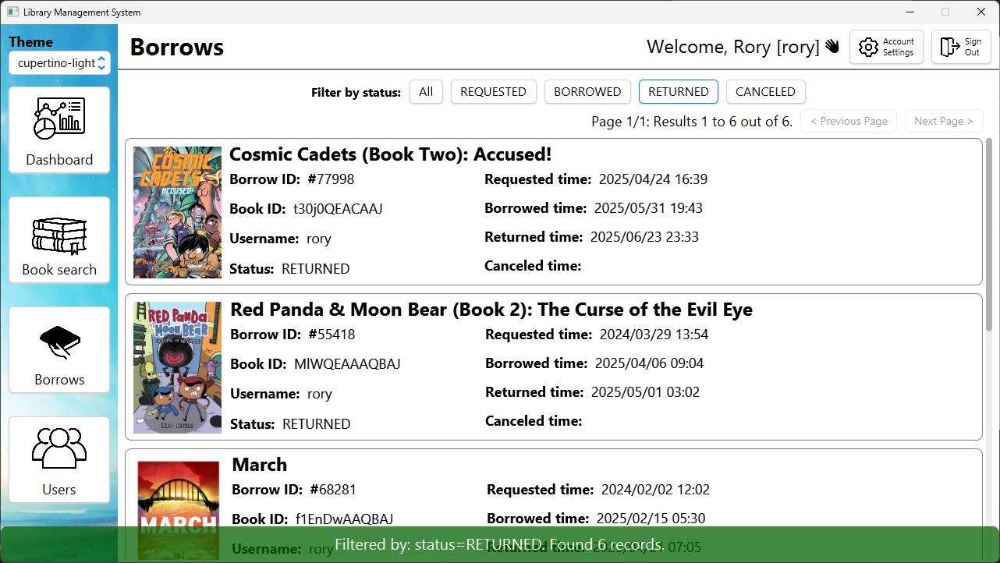

# Library Management System 

- **Course:** Object-Oriented Programming
- **Course Code:** 2425H_INT2204_60
- **Semester:** Summer 2024–2025

## Contributors
- **24021400 Nguyễn Trọng Đại** – [brownfox2k6](https://github.com/brownfox2k6)
- **24021408 Lục Thị Diệp** – [DiepLuc](https://github.com/DiepLuc)

## Brief Description
An application that helps users search for books, view detailed information, and manage borrowing activities. It integrates with the Google Books API for accurate book data, and supports QR code generation for quick access. Members can request to borrow books and track their borrowing history, while admins can manage stock and monitor all borrow records.

## Core Features

### Dashboard
- View recommended books
- View a list of the most borrowed books
- View statistics on the number of borrows in the last 30 days

<strong>[Image] Dashboard</strong>

### Book Search
Search for books using the Google Books API by title, authors, publisher, category, [ISBN](https://en.wikipedia.org/wiki/ISBN) identifier, [LCCN](https://en.wikipedia.org/wiki/Library_of_Congress_Control_Number) identifier, and [OCLC](https://en.wikipedia.org/wiki/OCLC#Identifiers_and_linked_data) identifier

<strong>[Image] Book Search</strong>

### Book Details
- View detailed information about a selected book
- Copy the link to Google Books for quick reference
- Generate a QR code linking to the Google Books page for mobile access
- Admins can manage stock quantities with simple add/remove controls
- Members can request to borrow the selected book

<strong>[Image] Book Details – Admin View</strong>

<strong>[Image] Book Details – Member View</strong>

<strong>[Image] Book Details – View QR Code</strong>

### Borrows
- View personal borrow records (for members) or all borrow records (for admins)
- Filter by borrow status: REQUESTED, BORROWED, RETURNED, or CANCELED
- (Admins only) Filter by username

<strong>[Image] Borrows – Member View – All Borrows</strong>

<strong>[Image] Borrows – Member View – Filtered</strong>

<strong>[Image] Borrows – Admin View – Filtered</strong>

## Tech Stack
- **Java** – Core application logic and API integration
- **Google Books API** – Retrieving and displaying book data
- **JavaFX** – User interface development and event handling
- **CSS** – Styling and customizing JavaFX components
- **FXML** – Structuring UI layout separately from Java code  
